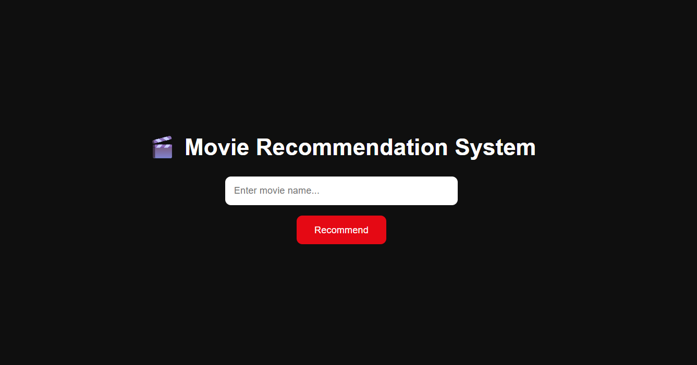
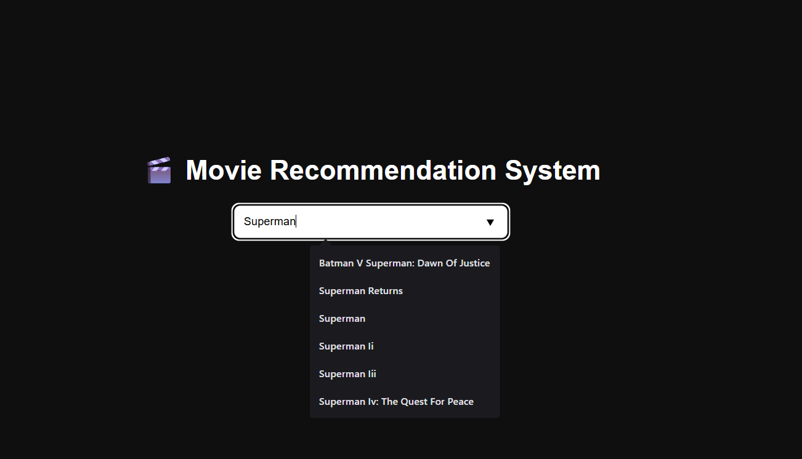
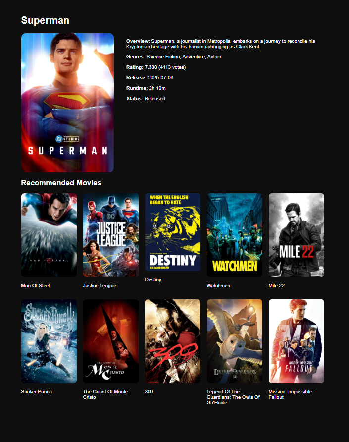

# 🎬 End-to-End Movie Recommendation System

An **end-to-end Movie Recommendation System** built using **Machine Learning (NLP)** and **Flask** that recommends similar movies based on content similarity and also performs **sentiment classification on movie reviews**.

This project demonstrates the complete ML lifecycle — data preprocessing, model training & evaluation, backend integration, frontend UI, and version control using GitHub.

---
## 📸 Application Screenshots

### 🔹 Home Page
Movie search interface where users can enter a movie name.



---

### 🔹 Autocomplete Search
Dynamic movie name suggestions while typing.



---

### 🔹 Movie Details & Recommendations
Displays selected movie details along with recommended movies.




## 🚀 Features

- 🔍 Search movies by name
- 🎯 Content-based movie recommendations
- 🧠 NLP-based similarity using **TF-IDF & Cosine Similarity**
- 📝 Sentiment classification on movie reviews
- 🌐 Movie metadata fetched using **TMDB API**
- 🖥️ Interactive web UI using HTML, CSS & JavaScript
- 🔄 End-to-end pipeline: UI → Flask → ML Model → UI

---

## 🧠 Machine Learning Models

Multiple ML models were trained and evaluated for sentiment classification.

### 📊 Model Comparison

| Model | Accuracy | Precision | Recall | F1-Score |
|-----|---------|----------|--------|----------|
| Random Forest | 0.989 | 0.989 | 0.993 | 0.991 |
| Logistic Regression | 0.986 | 0.983 | 0.993 | 0.988 |
| **Support Vector Classifier (SVC)** | **0.990** | **0.988** | **0.995** | **🔥 0.991 (Best)** |
| Multinomial Naive Bayes | 0.975 | 0.969 | 0.988 | 0.978 |

### 🏆 Final Model Used
> **Support Vector Classifier (SVC)** > Selected due to its **highest F1-score and recall**, making it the most reliable model for text-based sentiment classification.

---

## 🧰 Tech Stack

### 🧠 Machine Learning
- Python
- Pandas, NumPy
- Scikit-learn
- NLP (TF-IDF, Cosine Similarity)
- Support Vector Machine (SVC)

### 🌐 Backend
- Flask

### 🎨 Frontend
- HTML
- CSS
- JavaScript (jQuery)

### 📊 Tools & Utilities
- TMDB API
- Conda Virtual Environment
- Git & GitHub

---

## 📂 Project Structure

```text
End-to-End-Movie-Recommendation-System/
│
├── Artifacts/                # Data & trained models
│   └── main_data.csv
│
├── static/                   # CSS & JavaScript
│   ├── style.css
│   └── recommend.js
│
├── templates/                # HTML templates
│   ├── home.html
│   └── recommend.html
│
├── app.py                    # Flask application
├── requirements.txt          # Dependencies
├── README.md
└── .gitignore
```

## ⚙️ How It Works

1. User searches for a movie
2. Movie details fetched using **TMDB API**
3. Movie title sent to Flask backend
4. Content similarity calculated using **TF-IDF + Cosine Similarity**
5. Similar movies returned
6. UI displays movie details and recommendations

---


## ⭐ Conclusion

This project showcases a real-world ML application with an end-to-end pipeline and strong model evaluation.
The use of Support Vector Classifier (SVC) ensures high performance and reliability for NLP-based sentiment analysis.

## ⭐ If you like this project, don’t forget to star the repository!

---

# End-to-End-Movie-Recommendation-System
